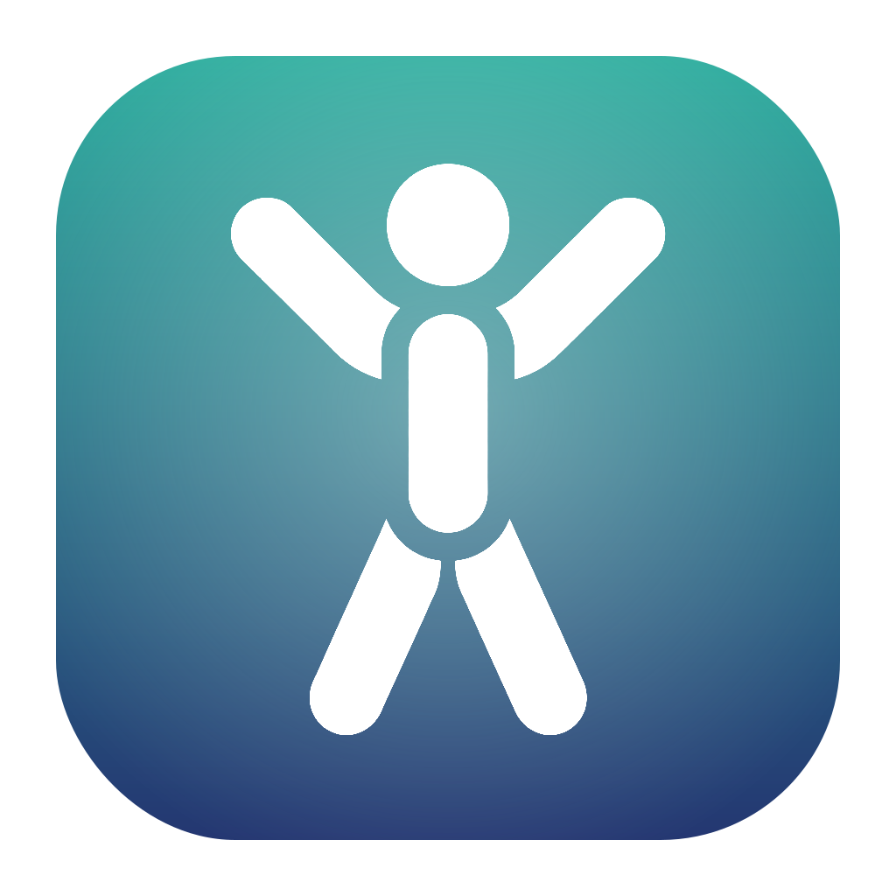

# Recess

> 一个逼你按时起身护腰的极简番茄钟菜单栏 App。



市面上的番茄钟越做越重，任务清单、标签、统计图表、云同步……功能堆成一座山。Recess 反过来：只做一件事——**到点提醒你起身活动、放松腰部**，然后回到工作。没有暂停，没有历史，没有账号。纯粹得像课间铃响。

## 为什么是 Recess

- **到点逼你休息**：工作段一结束，立刻弹一个置顶、居中、不抢焦点的休息浮窗，配上结束音效和系统通知。差异化不在"番茄"，在"到点滚去休息"。
- **一眼区分工作 / 休息**：菜单栏进行中显示倒计时，工作段是橙色胶囊、休息段是绿色胶囊，扫一眼就知道当前在哪个阶段。
- **原生、轻量、安静**：Swift + SwiftUI 原生实现，常驻内存约 15MB，无 Dock 图标、无后台进程骚扰，安静地待在菜单栏。
- **零成本**：免费、开源，装上即用。

## 安装

### 方式一：下载 DMG（推荐）

前往 [Releases](https://github.com/NotWizard/recess/releases) 页面下载最新 `Recess-x.x.x.dmg`，打开后将 **Recess** 拖入 **Applications** 文件夹即可。

首次运行若被 Gatekeeper 拦截：在 Finder 中找到 Recess，右键选择「打开」，在弹窗中确认「打开」即可。之后可正常双击启动。

### 方式二：Homebrew

```bash
brew install --cask recess
```

> Homebrew Cask 尚未正式提交，正式发版后可用。

### 方式三：源码构建

需要 macOS 13+ 与 Swift Command Line Tools（无需完整 Xcode）。

```bash
git clone https://github.com/NotWizard/recess.git
cd recess
scripts/build_app.sh      # 构建 Recess.app
scripts/build_dmg.sh      # （可选）生成可分发 DMG
```

构建产物在 `build/` 目录下。

## 怎么用

1. 启动后菜单栏出现一个计时器图标，点击它弹出下拉面板。
2. 点「开始工作」进入工作段（默认 25 分钟）。菜单栏图标变为橙色胶囊倒计时。
3. 时间到：结束音效响起 + 系统通知弹出 + 居中置顶休息浮窗出现。点「开始休息」进入休息段（短休 5 分钟 / 每 4 个工作段后长休 15 分钟），或「跳过」放弃这次休息。
4. 休息时菜单栏倒计时变绿色胶囊。
5. 面板里随时显示「今日番茄」数——只统计工作段自然完成的次数。

**默认时长**：工作 25 / 短休 5 / 长休 15 / 每 4 个工作段后长休。四项都能在「设置」里改。

**设计取舍**：
- 没有暂停。要么做完，要么手动结束（作废、不计入今日数，但循环计数不清零，下次接着数）。
- 没有历史统计。只有「今日番茄数」，跨天自动归零。
- 进行中的计时不持久化，重启即回到空闲——鼓励你专注当下，而不是纠结中断。

## 它不做什么

为了守住极简，以下功能**刻意不做**：

- 暂停功能
- 历史统计 / 趋势图表
- 多套周期方案
- 任务清单 / 标签 / 项目分类
- 云同步 / 账号体系
- 全屏强制打断（用可关闭的居中浮窗代替）

## 系统要求

- macOS 13 (Ventura) 或更高
- 约 15MB 内存占用

## 开发

本项目用 Swift Package Manager 管理，不依赖 Xcode 工程。

```
RecessCore/   纯逻辑计时引擎（可独立测试）
Recess/      SwiftUI + AppKit 可执行（菜单栏、浮窗、设置）
RecessTests/ 无框架断言测试
scripts/     构建与打包脚本
```

跑测试：

```bash
swift run RecessTests          # 引擎逻辑：39 项
swift run Recess --selftest    # GUI 层无界面自检：42 项
```

详细技术方案见 [PROJECT.md](PROJECT.md)，变更记录见 [CHANGELOG.md](CHANGELOG.md)。

## 许可证

MIT
